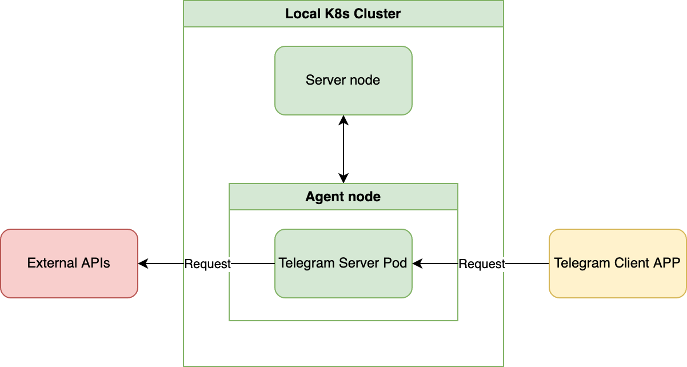

# Telegram Bot

## Background

This is a Telegram bot for my personal use. It can:

- Receive csv files and store them in Amazon S3.
- Receive markdown files, phrase them into JSON format and store them in Amazon DynamoDB.

## Misc

There are two type of version: application version and infrastructure version
- Application version = Repository release tag = package.json version = Docker image version
- Infrastructure version = Helm chart version

## Architecture

## Tech stack

- Runtime: NodeJs, TypeScript
- Hosting: K8s
- DevOps: Docker
- Unit test: Mocha, Chai
- Package manager: Helm, Npm

## Get started

If you want to:

- Run program in development mode: `npm run dev`
- (Optional) Compile TS code into JS and store JS in `dist/`: `npm run build`
- Run program in production mode: `npm run prod`

## Ref

- [Supported Message Type](https://github.com/DefinitelyTyped/DefinitelyTyped/blob/273e685e53e543a74750a00403a1fc337787d6ce/types/node-telegram-bot-api/index.d.ts#L43-L69)
- [Existing Bots](https://influencermarketinghub.com/top-telegram-bots/)
- [Telegram Bot (1) 懶得自己做的事就交給機器人吧](https://z3388638.medium.com/telegram-bot-1-%E6%87%B6%E5%BE%97%E8%87%AA%E5%B7%B1%E5%81%9A%E7%9A%84%E4%BA%8B%E5%B0%B1%E4%BA%A4%E7%B5%A6%E6%A9%9F%E5%99%A8%E4%BA%BA%E5%90%A7-c59004dc6c7b)
- [Telegram Bot API](https://core.telegram.org/bots/api#available-methods)
- [從零開始的 Telegram Bot | Sean's Note](https://blog.sean.taipei/2017/05/telegram-bot)
- [[TG 機器人] Group Help Bot 歡迎詞設定!準備好這些東西,5分鐘搞定它](https://mobilefoto.info/2020/02/23/2184/)
- [[ChatOps] 簡單介紹如何開發一個 Telegram Bot](https://godleon.github.io/blog/ChatOps/howto-develop-telegram-chatbot/)
- https://zaoldyeck.medium.com/%E6%89%8B%E6%8A%8A%E6%89%8B%E6%95%99%E4%BD%A0%E6%80%8E%E9%BA%BC%E6%89%93%E9%80%A0-telegram-bot-a7b539c3402a
- [Telegram Bot (1) 懶得自己做的事就交給機器人吧](https://z3388638.medium.com/telegram-bot-1-%E6%87%B6%E5%BE%97%E8%87%AA%E5%B7%B1%E5%81%9A%E7%9A%84%E4%BA%8B%E5%B0%B1%E4%BA%A4%E7%B5%A6%E6%A9%9F%E5%99%A8%E4%BA%BA%E5%90%A7-c59004dc6c7b)
- [（一）一步步打造 Telegram Bot](https://zaoldyeck.medium.com/%E6%89%8B%E6%8A%8A%E6%89%8B%E6%95%99%E4%BD%A0%E6%80%8E%E9%BA%BC%E6%89%93%E9%80%A0-telegram-bot-a7b539c3402a)